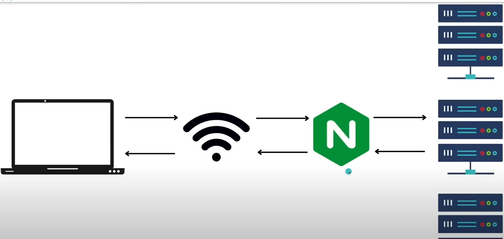

## 5. NGINX for Beginners:

This is an introductory course on NGINX based on <www.youtube.com/watch?v=9t9Mp0BGnyI>.

NGINX is a webserver. When we load a webpage we have various types of content in it be it images, text, 3D models, videos, data pulled using APIs etc. The system or computer that serves this webcontent is a web server. 

NGINX is a webserver and a reverse proxy that manages traffic if the actual website is replicated to cater to larger no.of requests. Thus it acts as a loadbalancer.Also it helps in encryption and decryption of packets to serve https requests instead of http.  



A good idea of NGINX is described in <www.youtube.com/watch?v=WuH0T9FHDZ4>. If we create a website and deploy it on a server say AWS, it is served to customers on a port on AWS and the link is matched to that link. For example, GPU servers offered to students after we SSH into it and say start a jupyter notebook gives up a starting link on the terminal, we use port forwarding in putty to view that link on localhost with a different port. But say in production our website is popular, we need to scale the application and additionally add a new port, the user has multiple options for portforwarding and this is where NGINX acts as a gateway to moderate the traffic for both the ports. It can also have cache if needed to a certain port to serve faster.


To install nginx on windows follow <www.youtube.com/watch?v=4539ULMhY_I>

The main file in NGINX is "nginx.conf". In windows it is present in the NGINX installation directory. This file has all the settings that are needed for a server, be it the port to communicate with, IPs allowed and stuff. All the info in this file are represented as key-value pairs(e.g in ```worker_processes  1```; worker_processes is key and value is 1). These key-value pairs are called ```directives```.

The blocks of code like below are called ```context```. So we have directives for specific context. For the events context, worker_connections directive has a value 1024.
```
events {
    worker_connections  1024;
}
```

Each nginx.conf file has mandatory http and events contexts and inside http context we have a server context. The base template is as follows:
```
http {
    server{
        listen localhost_port;
        root directory_path_of_folder_we_serve_that_has_index_html_file;
    }
}
events {}
```

Once conf file is updated, do 
```bash
nginx -s reload```  


